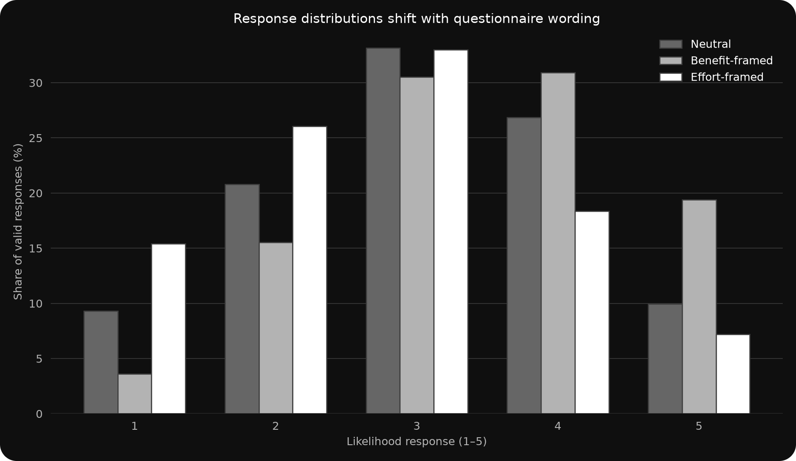
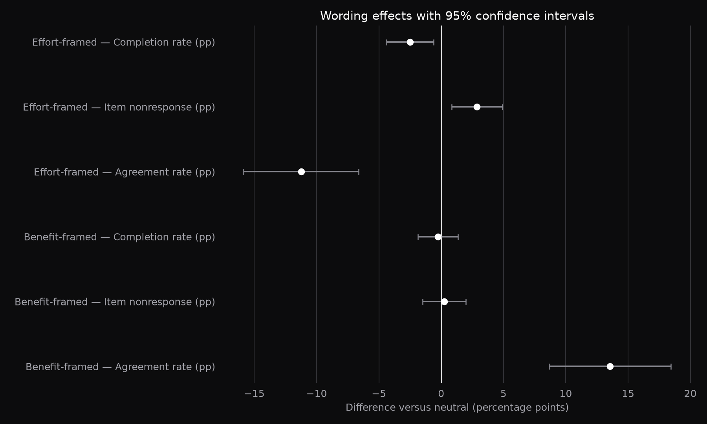
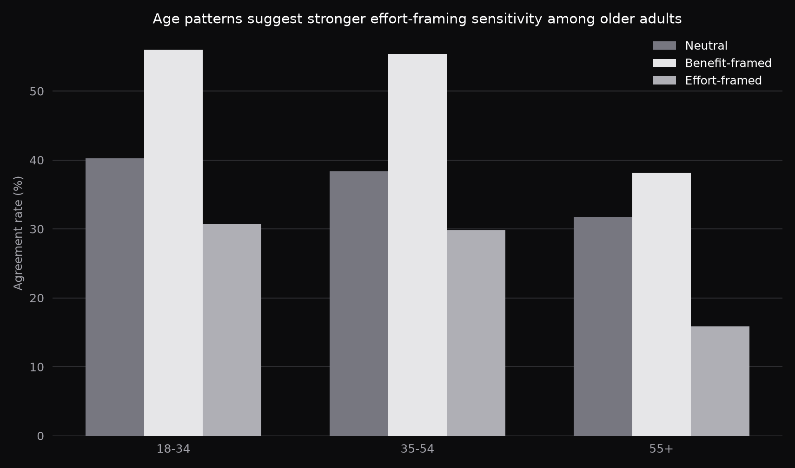

# Questionnaire Wording Experiment

## Project Snapshot

| Project type | Dataset | Tools | Outputs |
|---|---|---|---|
| Simulated Survey Experiment | 2,400 Randomly Assigned UK Adult Respondents | Python / Pandas / NumPy / Matplotlib | Arm-Level Metrics; A/B Contrasts; Effect Sizes; Confidence Intervals; Subgroup Audit; Dark Figures |

**Skills demonstrated:** Experimental Design · Survey Design · Questionnaire Development · Statistical Analysis · Significance Testing · A/B Testing

## Study Context

This simulated experiment evaluates whether short additions to a questionnaire item change reported likelihood of using a fictional council's online services. Respondents were randomly assigned in equal proportions to neutral wording, a benefit frame mentioning time saved, or an effort frame mentioning setup time. All respondents, organisations and outcomes are synthetic.

## Experimental Design

The three arms differ by one clause while retaining the same five-point response scale. Random assignment identifies the intention-to-treat effect of wording under the simulation. The neutral arm is the pre-specified control; agreement (responses 4–5) is the primary binary outcome. Mean response, item nonresponse, survey completion and duration are secondary outcomes.

| Arm | Questionnaire wording |
|---|---|
| Neutral | How likely are you to use the council's new online services? |
| Benefit-framed | How likely are you to use the council's new online services, which can save residents time? |
| Effort-framed | How likely are you to use the council's new online services, even if setup takes a few minutes? |

## Results

| Wording arm | Mean (1–5) | Agreement | Item nonresponse | Completion | Median duration |
|---|---:|---:|---:|---:|---:|
| Neutral | 3.07 | 36.8% | 3.1% | 97.4% | 209s |
| Benefit-framed | 3.47 | 50.3% | 3.4% | 97.1% | 213s |
| Effort-framed | 2.76 | 25.5% | 6.0% | 94.9% | 222s |

The benefit frame increased agreement by +13.5 percentage points versus neutral (95% CI +8.7 to +18.4). The effort frame changed agreement by -11.2 points (95% CI -15.9 to -6.6). These shifts arise from wording alone because assignment is random.

## Effect Sizes and Confidence Intervals

| Contrast | Outcome | Effect | 95% CI |
|---|---|---:|---:|
| Benefit-framed | Mean likelihood (points) | +0.40 | [+0.29, +0.51] |
| Benefit-framed | Agreement rate (pp) | +13.55 | [+8.65, +18.45] |
| Benefit-framed | Item nonresponse (pp) | +0.25 | [-1.49, +1.99] |
| Benefit-framed | Completion rate (pp) | -0.25 | [-1.85, +1.35] |
| Effort-framed | Mean likelihood (points) | -0.32 | [-0.43, -0.20] |
| Effort-framed | Agreement rate (pp) | -11.24 | [-15.85, -6.63] |
| Effort-framed | Item nonresponse (pp) | +2.88 | [+0.83, +4.92] |
| Effort-framed | Completion rate (pp) | -2.50 | [-4.39, -0.61] |

For the mean scale, Cohen's d was +0.36 for benefit framing and -0.28 for effort framing. Confidence intervals use large-sample independent-group standard errors; intervals excluding zero correspond to a two-sided 5% significance test.

## Completion Behaviour and Heterogeneity

Effort framing produced both a longer median interview and lower completion, consistent with the clause making burden more salient. The age audit is exploratory: the simulated negative effort effect is strongest among respondents aged 55+, so it should be treated as a diagnostic rather than a separately powered confirmatory test.

## Interpretation

The experiment demonstrates that apparently modest questionnaire edits can change substantive estimates and response behaviour. Benefit language raises expressed adoption likelihood; effort language lowers it and modestly increases response burden. A production survey should select neutral wording when the goal is measurement rather than persuasion, pre-register one primary estimand, and test wording before trend comparisons or rollout.

## Figures

### Response distributions

### Effect sizes and confidence intervals

### Agreement by age

## Project Files

- [`data/questionnaire_wording_responses.csv`](data/questionnaire_wording_responses.csv) — respondent-level synthetic experiment.
- [`data/questionnaire_wording_codebook.csv`](data/questionnaire_wording_codebook.csv) — variable definitions.
- [`data/questionnaire_wording_scenario.csv`](data/questionnaire_wording_scenario.csv) — deterministic design parameters and wording.
- [`outputs/arm_summary.csv`](outputs/arm_summary.csv) — response, nonresponse and completion metrics by arm.
- [`outputs/experimental_effects.csv`](outputs/experimental_effects.csv) — control contrasts, effect sizes and 95% confidence intervals.
- [`outputs/response_distribution.csv`](outputs/response_distribution.csv) — five-point response distribution by arm.
- [`outputs/subgroup_heterogeneity.csv`](outputs/subgroup_heterogeneity.csv) — exploratory age-band results.
- [`figures/`](figures/) — publication-ready dark-theme figures.
